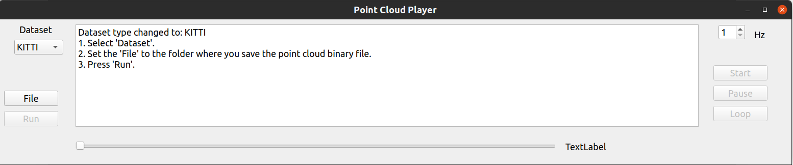
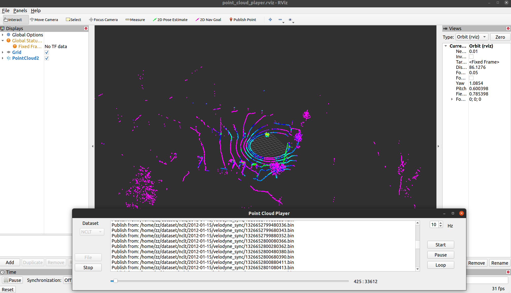

# Point Cloud Player

## Overview

Point Cloud Player is a Qt-based application for visualizing and publishing **binary** point cloud data as ROS topics. This player allows users to select datasets, and control the playback of these files with various options like play, pause, and loop.

## Features

- **Dataset Selection**: Choose from multiple datasets (KITTI, NCLT, MulRan).

- **File Selection**: Select a directory containing point cloud **binary** files(.bin).

- **Playback Control**: Start, stop, pause, and loop single frame.

- **ROS Integration**: Publish point cloud data as ROS topics.

  

  

## Dependencies

- **Qt**: For GUI components.

  ```
  sudo apt-get install qt5-default qtcreator
  ```

- **ROS**: For publishing point cloud data.

  Follow the instructions on the [ROS installation page](http://wiki.ros.org/ROS/Installation) for your platform.

- **PCL**: For handling point cloud data.

  ```
  sudo apt-get install libpcl-dev
  ```

## Run

**Compile Project：**

```
git clone to {project_ws}/src/
catkin_ws
source devel/setup.bash
roslaunch point_cloud_player point_cloud_player_node.launch
```

**Using the GUI**:

- **Select Dataset**: Choose the dataset type from the dropdown menu.

- **Select Folder**: Click the 'File' button to select the **folder** which contains your point cloud files. 
  folder should like:

  ```
  folder
    ├── 000000.bin
    ├── 000001.bin
    ├── 000002.bin
    ├── .....
  ```

- **Run**: Click the 'Run' button to start playback.

## License

This project is licensed under the MIT License.
